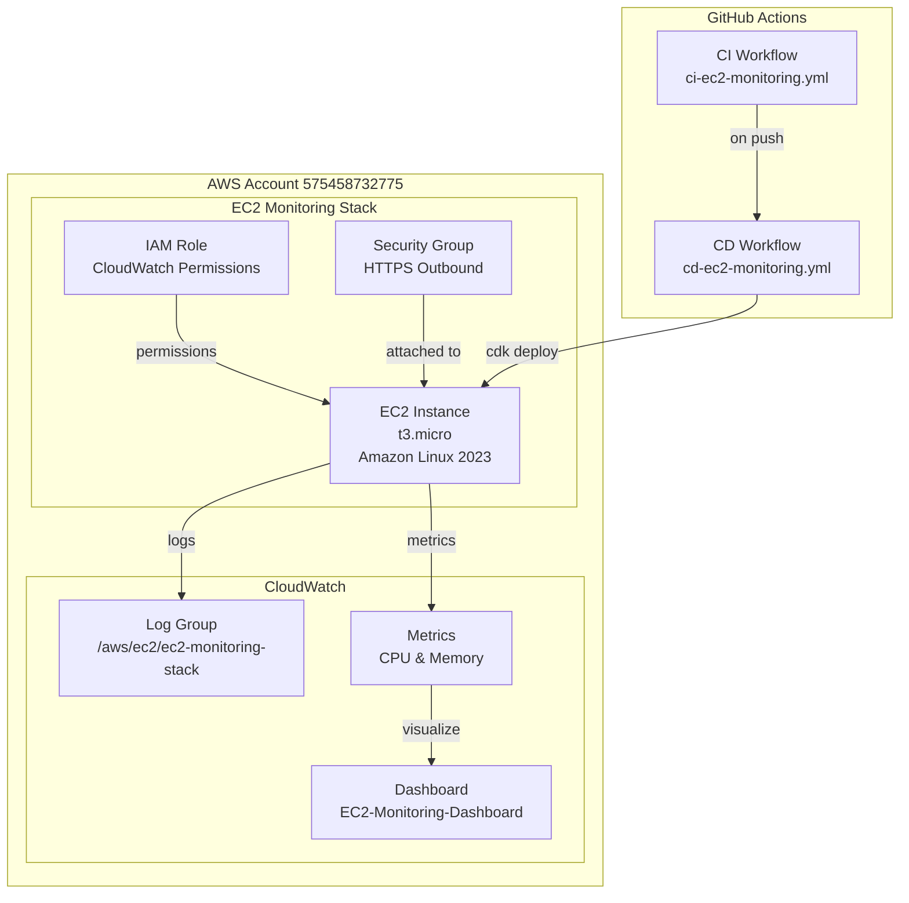
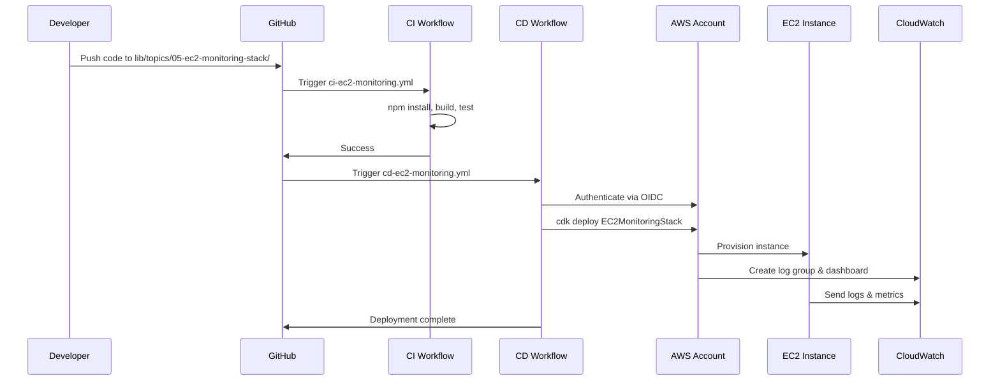

# Design Document: EC2 Monitoring Stack

## Overview

The EC2 Monitoring Stack is a comprehensive AWS CDK infrastructure solution that provisions an EC2 instance with integrated CloudWatch monitoring capabilities and automated CI/CD pipelines. This feature follows the project's modular topic-based architecture pattern, implementing all infrastructure as code using TypeScript and AWS CDK.

The stack creates a complete monitoring solution including:
- A t3.micro EC2 instance running Amazon Linux 2023 with IMDSv2 enabled
- CloudWatch log groups for application and system log collection
- CloudWatch dashboards visualizing CPU and memory utilization metrics
- GitHub Actions workflows for continuous integration and deployment
- Proper IAM roles and security group configurations

This implementation is organized as topic `05-ec2-monitoring-stack` under `lib/topics/`, following the established pattern of numbered, self-contained migration workstreams. The stack integrates with the existing CI/CD infrastructure and can be deployed independently using `cdk deploy EC2MonitoringStack`.

## Architecture

### High-Level Architecture



### Component Interaction Flow



### Directory Structure

```
lib/topics/05-ec2-monitoring-stack/
├── index.ts                    # Main stack definition
├── constructs/
│   ├── monitored-ec2.ts       # EC2 instance with monitoring
│   ├── log-group-config.ts    # CloudWatch log group setup
│   └── metrics-dashboard.ts   # Dashboard configuration
└── config/
    └── cloudwatch-agent.json  # CloudWatch agent configuration

.github/workflows/
├── ci-ec2-monitoring.yml      # Continuous integration
└── cd-ec2-monitoring.yml      # Continuous deployment

bin/app.ts                      # Stack registration
```

## Components and Interfaces

### 1. EC2MonitoringStack (Main Stack)

**Purpose**: Top-level CDK stack that orchestrates all resources for the EC2 monitoring solution.

**Responsibilities**:
- Instantiate and configure the EC2 instance
- Create CloudWatch log groups and dashboards
- Set up IAM roles and security groups
- Export stack outputs (instance ID)

**Interface**:
```typescript
export class EC2MonitoringStack extends cdk.Stack {
  public readonly instance: ec2.Instance;
  public readonly logGroup: logs.LogGroup;
  public readonly dashboard: cloudwatch.Dashboard;
  
  constructor(scope: Construct, id: string, props?: cdk.StackProps);
}
```

**Key Properties**:
- `stackName`: "EC2MonitoringStack"
- `env.account`: "575458732775"
- `env.region`: "us-east-1"

### 2. MonitoredEC2Instance (Custom Construct)

**Purpose**: Encapsulates EC2 instance creation with monitoring configuration.

**Responsibilities**:
- Create EC2 instance with specified configuration
- Configure IMDSv2 settings
- Set up security group with HTTPS outbound rules
- Install and configure CloudWatch agent via user data
- Create IAM role with CloudWatch permissions

**Interface**:
```typescript
export interface MonitoredEC2InstanceProps {
  vpc: ec2.IVpc;
  instanceType: ec2.InstanceType;
  machineImage: ec2.IMachineImage;
  logGroup: logs.ILogGroup;
}

export class MonitoredEC2Instance extends Construct {
  public readonly instance: ec2.Instance;
  public readonly securityGroup: ec2.SecurityGroup;
  public readonly role: iam.Role;
  
  constructor(scope: Construct, id: string, props: MonitoredEC2InstanceProps);
}
```

**Configuration Details**:
- Instance Type: `t3.micro`
- AMI: Amazon Linux 2023 (latest)
- IMDSv2: Required, hop limit = 1
- Security Group: Outbound HTTPS (port 443) to 0.0.0.0/0

### 3. CloudWatchLogGroupConfig (Custom Construct)

**Purpose**: Configure CloudWatch log group for EC2 instance logs.

**Responsibilities**:
- Create log group with proper naming convention
- Set retention period
- Apply resource tags
- Configure log streams for application and system logs

**Interface**:
```typescript
export interface CloudWatchLogGroupConfigProps {
  logGroupName: string;
  retentionDays: logs.RetentionDays;
  instanceId: string;
}

export class CloudWatchLogGroupConfig extends Construct {
  public readonly logGroup: logs.LogGroup;
  
  constructor(scope: Construct, id: string, props: CloudWatchLogGroupConfigProps);
}
```

**Configuration Details**:
- Log Group Name: `/aws/ec2/ec2-monitoring-stack`
- Retention: 30 days
- Tags: `InstanceId`, `StackName: EC2MonitoringStack`
- Log Streams: `/var/log/application.log`, `/var/log/messages`

### 4. MetricsDashboard (Custom Construct)

**Purpose**: Create CloudWatch dashboard with CPU and memory metrics visualization.

**Responsibilities**:
- Create dashboard with specified name
- Add CPU utilization widget
- Add memory utilization widgets
- Configure time range controls
- Set up metric aggregation (5-minute averages)

**Interface**:
```typescript
export interface MetricsDashboardProps {
  dashboardName: string;
  instance: ec2.IInstance;
}

export class MetricsDashboard extends Construct {
  public readonly dashboard: cloudwatch.Dashboard;
  
  constructor(scope: Construct, id: string, props: MetricsDashboardProps);
  
  private createCpuWidget(): cloudwatch.GraphWidget;
  private createMemoryWidget(): cloudwatch.GraphWidget;
}
```

**Dashboard Configuration**:
- Name: `EC2-Monitoring-Dashboard`
- Default Time Range: 3 hours
- Available Ranges: 1h, 3h, 12h, 1d, 1w, custom
- Widget Layout: Vertical stacking (CPU above memory)

**CPU Widget**:
- Metric: `AWS/EC2` namespace, `CPUUtilization`
- Statistic: Average
- Period: 5 minutes
- Y-axis: 0-100%

**Memory Widget**:
- Metrics: `CWAgent` namespace
  - `mem_used_percent`
  - `mem_available_percent`
  - `mem_used`
- Statistic: Average
- Period: 5 minutes
- Y-axis: 0-100% (for percentages)

### 5. CloudWatch Agent Configuration

**Purpose**: Configure the CloudWatch agent to collect and send metrics and logs.

**Configuration File** (`config/cloudwatch-agent.json`):
```json
{
  "agent": {
    "metrics_collection_interval": 60,
    "run_as_user": "root"
  },
  "logs": {
    "logs_collected": {
      "files": {
        "collect_list": [
          {
            "file_path": "/var/log/application.log",
            "log_group_name": "/aws/ec2/ec2-monitoring-stack",
            "log_stream_name": "{instance_id}/application"
          },
          {
            "file_path": "/var/log/messages",
            "log_group_name": "/aws/ec2/ec2-monitoring-stack",
            "log_stream_name": "{instance_id}/system"
          }
        ]
      }
    }
  },
  "metrics": {
    "namespace": "CWAgent",
    "metrics_collected": {
      "mem": {
        "measurement": [
          {
            "name": "mem_used_percent",
            "rename": "mem_used_percent",
            "unit": "Percent"
          },
          {
            "name": "mem_available_percent",
            "rename": "mem_available_percent",
            "unit": "Percent"
          },
          {
            "name": "mem_used",
            "rename": "mem_used",
            "unit": "Bytes"
          }
        ],
        "metrics_collection_interval": 60
      }
    }
  }
}
```

**User Data Script**:
```bash
#!/bin/bash
# Install CloudWatch agent
wget https://s3.amazonaws.com/amazoncloudwatch-agent/amazon_linux/amd64/latest/amazon-cloudwatch-agent.rpm
rpm -U ./amazon-cloudwatch-agent.rpm

# Configure and start agent
/opt/aws/amazon-cloudwatch-agent/bin/amazon-cloudwatch-agent-ctl \
  -a fetch-config \
  -m ec2 \
  -s \
  -c ssm:AmazonCloudWatch-Config

# Ensure agent starts on boot
systemctl enable amazon-cloudwatch-agent
```

### 6. IAM Role and Permissions

**Purpose**: Grant EC2 instance necessary permissions for CloudWatch operations.

**Required Permissions**:
```typescript
const cloudWatchPolicy = new iam.PolicyStatement({
  effect: iam.Effect.ALLOW,
  actions: [
    'logs:CreateLogStream',
    'logs:PutLogEvents',
    'logs:DescribeLogStreams',
    'cloudwatch:PutMetricData',
    'ec2:DescribeVolumes',
    'ec2:DescribeTags'
  ],
  resources: ['*']
});
```

**Managed Policies**:
- `CloudWatchAgentServerPolicy` (AWS managed)

### 7. CI/CD Workflows

#### CI Workflow (`ci-ec2-monitoring.yml`)

**Trigger**: Push to `lib/topics/*-ec2-monitoring-stack/**`

**Jobs**:
```yaml
jobs:
  build:
    runs-on: ubuntu-latest
    timeout-minutes: 10
    steps:
      - uses: actions/checkout@v3
      - uses: actions/setup-node@v3
        with:
          node-version: '18'
      - run: npm install
      - run: npm run build
      - run: npm test
```

#### CD Workflow (`cd-ec2-monitoring.yml`)

**Trigger**: Push to `main` branch, path `lib/topics/*-ec2-monitoring-stack/**`, after CI success

**Jobs**:
```yaml
jobs:
  deploy:
    runs-on: ubuntu-latest
    needs: [ci-build]  # Depends on CI workflow
    concurrency:
      group: ec2-monitoring-deploy
      cancel-in-progress: false
    steps:
      - uses: actions/checkout@v3
      - uses: actions/setup-node@v3
        with:
          node-version: '18'
      - uses: aws-actions/configure-aws-credentials@v2
        with:
          role-to-assume: ${{ secrets.AWS_ROLE_ARN }}
          aws-region: us-east-1
      - run: npm install
      - run: npx cdk deploy EC2MonitoringStack --require-approval never
        timeout-minutes: 10
```

**Required Secrets**:
- `AWS_ROLE_ARN`: IAM role ARN for OIDC authentication
- `AWS_REGION`: Target region (us-east-1)

**Required IAM Permissions** (for deployment role):
- `cloudformation:*`
- `ec2:*`
- `logs:*`
- `cloudwatch:*`
- `iam:PassRole`
- `iam:CreateRole`
- `iam:AttachRolePolicy`

## Data Models

### Stack Outputs

```typescript
interface EC2MonitoringStackOutputs {
  InstanceId: string;           // EC2 instance ID
  LogGroupName: string;         // CloudWatch log group name
  DashboardName: string;        // CloudWatch dashboard name
  DashboardUrl: string;         // Direct URL to dashboard
  SecurityGroupId: string;      // Security group ID
  InstanceRoleArn: string;      // IAM role ARN
}
```

### CloudWatch Metric Dimensions

```typescript
interface EC2MetricDimensions {
  InstanceId: string;           // EC2 instance identifier
}

interface CWAgentMetricDimensions {
  InstanceId: string;           // EC2 instance identifier
  host: string;                 // Hostname
}
```

### Log Event Structure

```typescript
interface CloudWatchLogEvent {
  timestamp: number;            // Unix timestamp in milliseconds
  message: string;              // Log message content
  logStreamName: string;        // Format: {instance_id}/{application|system}
}
```

### CDK Context

```typescript
interface EC2MonitoringContext {
  account: '575458732775';
  region: 'us-east-1';
  vpcId?: string;               // Optional: use existing VPC
  subnetId?: string;            // Optional: use specific subnet
}
```

## Correctness Properties

Since this feature implements Infrastructure as Code (IaC) using AWS CDK, traditional property-based testing is not applicable. Instead, correctness is validated through CDK snapshot tests, assertion tests, and integration tests that verify the infrastructure is configured correctly.

The following properties define the correctness criteria for this infrastructure:

### Property 1: Resource Configuration Correctness

*For any* deployment of the EC2MonitoringStack, all AWS resources SHALL be configured exactly as specified in the requirements.

**Validates: Requirements 1.3, 1.4, 1.5, 1.8, 2.1, 2.3, 3.1**

**Verification Method**: CDK assertion tests validate CloudFormation template contains correct resource properties (instance type, IMDSv2 settings, security group rules, log group configuration, dashboard name).

### Property 2: Deployment Idempotency

*For any* EC2MonitoringStack deployment, running `cdk deploy` multiple times with the same code SHALL produce the same infrastructure state without errors.

**Validates: Requirements 1.1, 5.8**

**Verification Method**: Deploy stack twice consecutively; second deployment should report "no changes" or complete successfully without modifying resources.

### Property 3: IAM Permission Sufficiency

*For any* EC2 instance created by this stack, the attached IAM role SHALL grant all permissions necessary for CloudWatch agent operations (log streaming, metric publishing).

**Validates: Requirements 2.7, 2.8**

**Verification Method**: CDK assertion tests verify IAM policy contains required actions (`logs:CreateLogStream`, `logs:PutLogEvents`, `cloudwatch:PutMetricData`). Integration tests verify logs and metrics successfully publish.

### Property 4: Resource Relationship Integrity

*For any* deployment of the EC2MonitoringStack, all resource dependencies SHALL be correctly established (EC2 instance references correct IAM role, security group, and log group).

**Validates: Requirements 1.7, 2.2**

**Verification Method**: CDK snapshot tests capture CloudFormation template structure including `Ref` and `GetAtt` references. Integration tests verify instance can write to log group.

### Property 5: Security Configuration Compliance

*For any* EC2 instance created by this stack, security configurations SHALL enforce IMDSv2 requirement and restrict network access to HTTPS outbound only.

**Validates: Requirements 1.4, 1.5**

**Verification Method**: CDK assertion tests verify `MetadataOptions.HttpTokens: required` and security group egress rules. Integration tests query instance metadata to confirm IMDSv2 enforcement.

### Property 6: Monitoring Data Flow

*For any* running EC2 instance in this stack, logs and metrics SHALL flow to CloudWatch within the specified time constraints (5 seconds for logs, 60 seconds for metrics).

**Validates: Requirements 2.4, 3.5, 4.5**

**Verification Method**: Integration tests deploy stack, wait for specified time period, then query CloudWatch APIs to verify log streams exist and contain events, and metrics are published.

### Property 7: Dashboard Visualization Completeness

*For any* CloudWatch dashboard created by this stack, it SHALL contain all required metric widgets (CPU utilization, memory used percent, memory available percent, memory used bytes) with correct configuration.

**Validates: Requirements 3.1, 3.2, 3.3, 3.4, 4.1-4.6**

**Verification Method**: CDK assertion tests verify dashboard resource exists. Integration tests retrieve dashboard body JSON and validate widget structure, metric namespaces, dimensions, and statistics.

### Property 8: CI/CD Pipeline Correctness

*For any* code change to the EC2 monitoring stack, the CI workflow SHALL execute build and test steps, and upon success on main branch, the CD workflow SHALL deploy to AWS account 575458732775.

**Validates: Requirements 5.1-5.7, 6.1-6.7, 7.1-7.3, 9.1-9.9**

**Verification Method**: Workflow validation tests parse YAML files and verify structure, triggers, path filters, and deployment commands. Manual testing verifies end-to-end workflow execution.

### Property 9: Stack Output Availability

*For any* successful deployment of the EC2MonitoringStack, CloudFormation outputs SHALL include instance ID, log group name, dashboard name, and dashboard URL.

**Validates: Requirements 1.9, 8.1-8.4**

**Verification Method**: CDK assertion tests verify output definitions exist in template. Integration tests query CloudFormation stack outputs after deployment.

### Property 10: Tag Propagation

*For any* CloudWatch log group created by this stack, it SHALL be tagged with the instance ID and stack name for resource tracking.

**Validates: Requirements 2.5, 2.6**

**Verification Method**: CDK assertion tests verify tag properties in CloudFormation template. Integration tests query log group tags via CloudWatch Logs API.

## Error Handling

### 1. CDK Synthesis Errors

**Scenario**: Invalid CDK construct configuration or TypeScript compilation errors

**Handling**:
- Fail fast during `cdk synth` command
- Display TypeScript compilation errors with file and line numbers
- CI workflow exits with code 1
- Prevent deployment of invalid infrastructure

**Example**:
```typescript
// Validation in construct
if (!props.vpc) {
  throw new Error('VPC is required for EC2MonitoringStack');
}
```

### 2. CloudWatch Agent Installation Failures

**Scenario**: CloudWatch agent fails to install or start on EC2 instance

**Handling**:
- Log errors to `/var/log/amazon-cloudwatch-agent/amazon-cloudwatch-agent.log`
- User data script includes error checking:
```bash
if ! rpm -U ./amazon-cloudwatch-agent.rpm; then
  echo "Failed to install CloudWatch agent" >> /var/log/user-data-error.log
  exit 1
fi
```
- Instance status checks will fail if agent doesn't start
- Manual intervention required to review logs via EC2 console

### 3. IAM Permission Errors

**Scenario**: EC2 instance lacks required permissions for CloudWatch operations

**Handling**:
- CloudWatch agent logs "AccessDenied" errors to agent log file
- Metrics and logs fail to publish
- Error message format: `AccessDenied: User: arn:aws:sts::575458732775:assumed-role/... is not authorized to perform: logs:PutLogEvents`
- Resolution: Update IAM role policy in CDK code and redeploy

**Prevention**:
```typescript
// Explicit permission validation in construct
const requiredActions = [
  'logs:CreateLogStream',
  'logs:PutLogEvents',
  'cloudwatch:PutMetricData'
];
// Add to role during construction
```

### 4. Dashboard Creation Failures

**Scenario**: CloudWatch dashboard creation fails during stack deployment

**Handling**:
- CDK deployment fails with CloudFormation error
- Error message indicates dashboard creation failure
- Stack rollback occurs automatically
- CD workflow exits with code 1 and logs error details

**Example Error**:
```
CREATE_FAILED | AWS::CloudWatch::Dashboard | EC2-Monitoring-Dashboard
Resource handler returned message: "Invalid dashboard body"
```

### 5. Deployment Timeout

**Scenario**: CDK deployment exceeds 600-second timeout

**Handling**:
- CD workflow terminates deployment after 10 minutes
- CloudFormation stack may be in UPDATE_IN_PROGRESS state
- Manual cleanup required via AWS console
- Workflow logs indicate timeout occurred

**Configuration**:
```yaml
- run: npx cdk deploy EC2MonitoringStack --require-approval never
  timeout-minutes: 10
```

### 6. AWS Authentication Failures

**Scenario**: GitHub Actions workflow cannot authenticate to AWS account 575458732775

**Handling**:
- CD workflow fails immediately with exit code 1
- Error message: "Unable to authenticate to AWS account 575458732775"
- Check OIDC configuration and IAM role trust policy
- Verify `AWS_ROLE_ARN` secret is correctly configured

**Example Error**:
```
Error: Could not assume role with OIDC: Access denied
```

### 7. Concurrent Deployment Conflicts

**Scenario**: Multiple CD workflow executions attempt to deploy simultaneously

**Handling**:
- GitHub Actions concurrency control queues subsequent executions
- Only one deployment runs at a time for the stack
- Queued deployments wait for current deployment to complete

**Configuration**:
```yaml
concurrency:
  group: ec2-monitoring-deploy
  cancel-in-progress: false
```

### 8. Log Delivery Failures

**Scenario**: EC2 instance cannot send logs to CloudWatch within 5-second SLA

**Handling**:
- CloudWatch agent buffers logs locally
- Retries with exponential backoff
- Logs error to agent log file if persistent failure
- Monitor agent status: `systemctl status amazon-cloudwatch-agent`

**Monitoring**:
- Check log group for missing log streams
- Review agent logs for connectivity or permission issues

## Testing Strategy

### Overview

This feature implements Infrastructure as Code (IaC) using AWS CDK. **Property-based testing is NOT appropriate** for IaC because:
- CDK code is declarative configuration, not functions with inputs/outputs
- Infrastructure resources have deterministic behavior defined by AWS
- Testing focuses on correct resource configuration, not algorithmic correctness

Instead, we use:
1. **CDK Snapshot Tests**: Verify CloudFormation template structure
2. **CDK Assertions**: Validate specific resource configurations
3. **Integration Tests**: Test deployed infrastructure behavior
4. **Linting and Type Checking**: Catch configuration errors early

### 1. CDK Snapshot Tests

**Purpose**: Detect unintended changes to CloudFormation templates

**Approach**:
- Use `@aws-cdk/assert` or `aws-cdk-lib/assertions` library
- Generate CloudFormation template via `cdk synth`
- Compare against stored snapshot
- Fail if template changes unexpectedly

**Example Test**:
```typescript
import { Template } from 'aws-cdk-lib/assertions';
import { EC2MonitoringStack } from '../lib/topics/05-ec2-monitoring-stack';

test('EC2 Monitoring Stack snapshot', () => {
  const app = new cdk.App();
  const stack = new EC2MonitoringStack(app, 'TestStack');
  const template = Template.fromStack(stack);
  
  expect(template.toJSON()).toMatchSnapshot();
});
```

**Validates**: Requirements 1.6, 5.8 (synthesis without errors)

### 2. CDK Assertion Tests

**Purpose**: Verify specific resource configurations match requirements

**Test Cases**:

#### Test: EC2 Instance Configuration
```typescript
test('EC2 instance has correct configuration', () => {
  const app = new cdk.App();
  const stack = new EC2MonitoringStack(app, 'TestStack');
  const template = Template.fromStack(stack);
  
  template.hasResourceProperties('AWS::EC2::Instance', {
    InstanceType: 't3.micro',
    ImageId: Match.anyValue(), // AMI ID varies by region
    MetadataOptions: {
      HttpTokens: 'required',
      HttpPutResponseHopLimit: 1
    }
  });
});
```
**Validates**: Requirements 1.3, 1.4, 1.8

#### Test: Security Group Rules
```typescript
test('Security group allows HTTPS outbound', () => {
  const app = new cdk.App();
  const stack = new EC2MonitoringStack(app, 'TestStack');
  const template = Template.fromStack(stack);
  
  template.hasResourceProperties('AWS::EC2::SecurityGroup', {
    SecurityGroupEgress: Match.arrayWith([
      Match.objectLike({
        IpProtocol: 'tcp',
        FromPort: 443,
        ToPort: 443,
        CidrIp: '0.0.0.0/0'
      })
    ])
  });
});
```
**Validates**: Requirement 1.5

#### Test: CloudWatch Log Group Configuration
```typescript
test('Log group has correct configuration', () => {
  const app = new cdk.App();
  const stack = new EC2MonitoringStack(app, 'TestStack');
  const template = Template.fromStack(stack);
  
  template.hasResourceProperties('AWS::Logs::LogGroup', {
    LogGroupName: '/aws/ec2/ec2-monitoring-stack',
    RetentionInDays: 30
  });
});
```
**Validates**: Requirements 2.1, 2.3

#### Test: Log Group Tags
```typescript
test('Log group has required tags', () => {
  const app = new cdk.App();
  const stack = new EC2MonitoringStack(app, 'TestStack');
  const template = Template.fromStack(stack);
  
  template.hasResourceProperties('AWS::Logs::LogGroup', {
    Tags: Match.arrayWith([
      { Key: 'StackName', Value: 'EC2MonitoringStack' }
    ])
  });
});
```
**Validates**: Requirements 2.5, 2.6

#### Test: IAM Role Permissions
```typescript
test('IAM role has CloudWatch permissions', () => {
  const app = new cdk.App();
  const stack = new EC2MonitoringStack(app, 'TestStack');
  const template = Template.fromStack(stack);
  
  template.hasResourceProperties('AWS::IAM::Policy', {
    PolicyDocument: {
      Statement: Match.arrayWith([
        Match.objectLike({
          Effect: 'Allow',
          Action: Match.arrayWith([
            'logs:CreateLogStream',
            'logs:PutLogEvents'
          ])
        })
      ])
    }
  });
});
```
**Validates**: Requirement 2.7

#### Test: CloudWatch Dashboard Exists
```typescript
test('CloudWatch dashboard is created', () => {
  const app = new cdk.App();
  const stack = new EC2MonitoringStack(app, 'TestStack');
  const template = Template.fromStack(stack);
  
  template.hasResourceProperties('AWS::CloudWatch::Dashboard', {
    DashboardName: 'EC2-Monitoring-Dashboard'
  });
});
```
**Validates**: Requirements 3.1, 4.7

#### Test: Stack Outputs
```typescript
test('Stack exports instance ID', () => {
  const app = new cdk.App();
  const stack = new EC2MonitoringStack(app, 'TestStack');
  const template = Template.fromStack(stack);
  
  template.hasOutput('InstanceId', {});
});
```
**Validates**: Requirement 1.9

### 3. Integration Tests

**Purpose**: Verify deployed infrastructure behaves correctly in AWS

**Approach**:
- Deploy stack to test environment
- Use AWS SDK to query resources
- Validate runtime behavior
- Clean up resources after tests

**Test Cases**:

#### Test: EC2 Instance Running
```typescript
test('EC2 instance is running', async () => {
  const ec2 = new EC2Client({ region: 'us-east-1' });
  const instanceId = getStackOutput('InstanceId');
  
  const response = await ec2.send(new DescribeInstancesCommand({
    InstanceIds: [instanceId]
  }));
  
  expect(response.Reservations[0].Instances[0].State.Name).toBe('running');
});
```
**Validates**: Requirement 1.2

#### Test: Log Group Receives Logs
```typescript
test('Log group receives logs within 5 seconds', async () => {
  const logs = new CloudWatchLogsClient({ region: 'us-east-1' });
  const logGroupName = '/aws/ec2/ec2-monitoring-stack';
  
  // Wait for logs to appear
  await new Promise(resolve => setTimeout(resolve, 10000));
  
  const response = await logs.send(new DescribeLogStreamsCommand({
    logGroupName
  }));
  
  expect(response.logStreams.length).toBeGreaterThan(0);
});
```
**Validates**: Requirement 2.4

#### Test: Dashboard Accessible
```typescript
test('Dashboard is accessible via console URL', async () => {
  const cloudwatch = new CloudWatchClient({ region: 'us-east-1' });
  
  const response = await cloudwatch.send(new GetDashboardCommand({
    DashboardName: 'EC2-Monitoring-Dashboard'
  }));
  
  expect(response.DashboardName).toBe('EC2-Monitoring-Dashboard');
  expect(response.DashboardBody).toBeDefined();
});
```
**Validates**: Requirement 4.7

### 4. Workflow Validation Tests

**Purpose**: Verify CI/CD workflows are correctly configured

**Approach**:
- Parse YAML workflow files
- Validate structure and required fields
- Check path filters and triggers

**Test Cases**:

#### Test: CI Workflow Structure
```typescript
test('CI workflow has correct structure', () => {
  const workflow = yaml.parse(
    fs.readFileSync('.github/workflows/ci-ec2-monitoring.yml', 'utf8')
  );
  
  expect(workflow.name).toBe('ci-ec2-monitoring.yml');
  expect(workflow.on.push.paths).toContain('lib/topics/*-ec2-monitoring-stack/**');
  expect(workflow.jobs.build.steps).toHaveLength(5);
});
```
**Validates**: Requirements 6.1, 6.2, 9.1-9.4

#### Test: CD Workflow Structure
```typescript
test('CD workflow has correct structure', () => {
  const workflow = yaml.parse(
    fs.readFileSync('.github/workflows/cd-ec2-monitoring.yml', 'utf8')
  );
  
  expect(workflow.name).toBe('cd-ec2-monitoring.yml');
  expect(workflow.on.push.branches).toContain('main');
  expect(workflow.jobs.deploy.steps.some(
    step => step.run?.includes('cdk deploy EC2MonitoringStack')
  )).toBe(true);
});
```
**Validates**: Requirements 7.1, 7.2, 9.6-9.9

### 5. Linting and Type Checking

**Purpose**: Catch configuration errors and type issues before deployment

**Tools**:
- TypeScript compiler (`tsc`)
- ESLint (if configured)
- CDK `cdk synth` (validates construct usage)

**Execution**:
```bash
npm run build  # TypeScript compilation
npx cdk synth  # CDK synthesis validation
```

**Validates**: Requirements 5.8, 6.4, 6.6

### Test Execution

**Local Development**:
```bash
# Run unit tests (snapshot + assertions)
npm test

# Run CDK synthesis
npm run build
npx cdk synth EC2MonitoringStack

# Deploy to test environment
npx cdk deploy EC2MonitoringStack --profile test
```

**CI Pipeline**:
- Runs on every push to `lib/topics/*-ec2-monitoring-stack/**`
- Executes: install → build → test
- Fails if any step returns non-zero exit code
- Timeout: 10 minutes

**CD Pipeline**:
- Runs after CI success on main branch
- Authenticates to AWS account 575458732775
- Deploys stack with `--require-approval never`
- Timeout: 10 minutes
- Concurrency: Sequential (no parallel deployments)

### Test Coverage Goals

- **CDK Constructs**: 100% of resources validated via assertions
- **Workflow Configuration**: 100% of required fields validated
- **Integration Tests**: Core functionality (instance running, logs flowing, dashboard accessible)
- **Error Scenarios**: IAM permission errors, deployment failures

### Continuous Monitoring

Post-deployment validation:
- CloudWatch alarms for instance health
- Log group metric filters for error patterns
- Dashboard review for metric availability
- Periodic integration test runs against production

